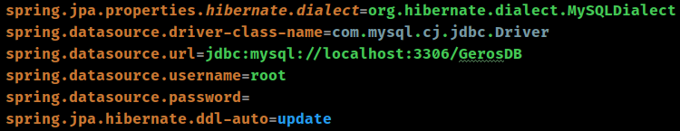
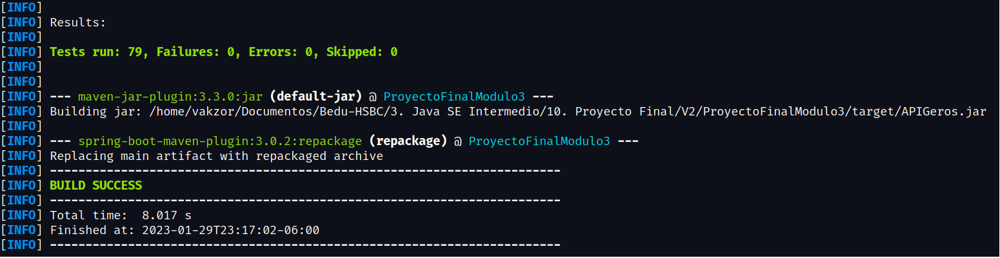
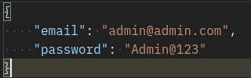
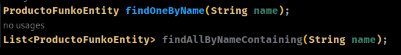

# Proyecto Módulo 03 Bedu - Hsbc

> Archivos .jar y .war generados: [Click](https://mega.nz/file/n0IRwBJS#ZSA8Gs0EfJIi0pfN5R9yZmRZwvwR_Y0cgj5BWg7Cqng)

### Configuración de la BD

* Asegúrate de tener creada una BD en MySql:

> Importante: En el video olvidé mencionar que de hicieron distintas pruebas unitarias (como se puede ver en el paquete de Test)

> Existe 1 usuario **ADMIN** que puede ver todos los endpoints, el resto de usuarios registrados llevarán el rol de **USER** por default:

### Endpoint de usuario:

> Link base servidor para consumir la API con Postman o Insomnia: `http://189.234.178.15:80/APIGeros`

**El servidor dejará de estar disponible el 02 de Febrero**

* `189.234.178.15/APIGeros/auth/register` <- Registrar usuario como el siguiente ejemplo:

`{
  "name": "Ignacio User",
  "email": "correo@correo.com",
  "password": "Usuario@123",
  "address": {
    "calle": "Calle 1",
    "numero": "90",
    "ciudad": "Neza",
    "estado": "Mexico",
    "codigoPostal": "9500",
    "colonia": "Siempre Viva"
  }
}`

* `189.234.178.15/APIGeros/login` <- Para loguear a los usuarios creados, ejemplo:

`{
    "email": "correo@correo.com",
    "password": "Usuario@123"
}`

* `189.234.178.15/APIGeros/clientes` <- Endpoint de consulta de todos los usuarios registrados **Sólo el usuario con rol de "ADMIN" puede ver este endpoint**

### Endpoint de producto:

* `189.234.178.15/APIGeros/funkos` <- Con todos los métodos CRUD proporcionados por JpaRepository:

